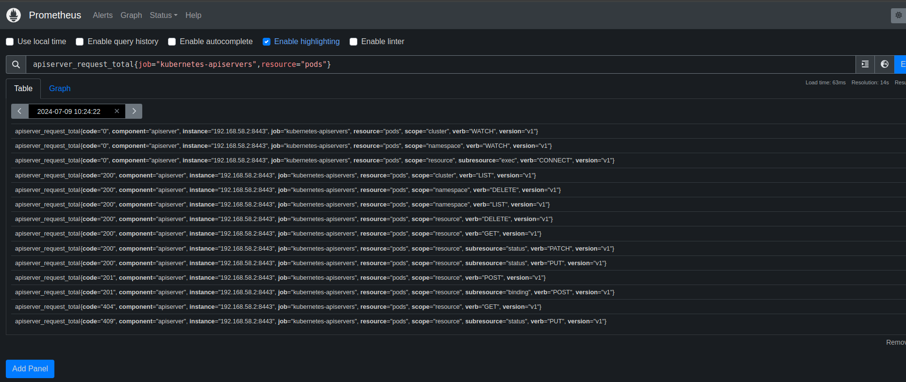
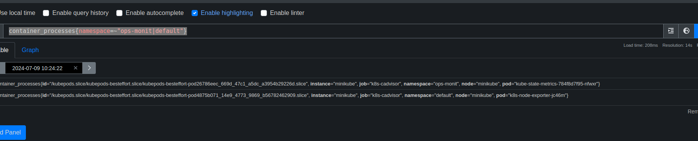

## Prometheus PromQL语法
PromQL（Prometheus Query Language）是prometheus专有的数据查询语言（DSL），其提供了简洁且贴近自然语言的语法实现了时序数据的分析计算能力。PromQL表现力丰富，支持条件查询、操作符，并且内建了大量内置函数，可供客户端针对监控数据的各种维度进行查询。

### 1. 数据类型
PromQL 表达式计算出来的值有以下几种类型：

瞬时向量 (Instant vector): 一组时序，每个时序只有一个采样值
区间向量 (Range vector): 一组时序，每个时序包含一段时间内的多个采样值
标量数据 (Scalar): 一个浮点数
字符串 (String): 一个字符串，暂时未用


#### 瞬时向量选择器
瞬时向量选择器用于选择一组时序，每个时序只有一个采样值。选择器由一个向量选择器前缀和一组标签选择器组成，中间用空格分隔。例如，`apiserver_request_total` 是一个瞬时向量选择器，它选择所有包含 `job` 标签且值为 `prometheus` 的时序，每个时序只有一个采样值，表示 prometheus 服务器接收到的 HTTP 请求总量。

```promql
apiserver_request_total{job="kubernetes-apiservers",resource="pods"}
```



　　匹配标签值时可以是等于，也可以使用正则表达式。总共有下面几种匹配操作符：

    =：完全相等

    !=： 不相等

    =~： 正则表达式匹配

    !~： 正则表达式不匹配

下面表达式筛选出了namespace是"ops-monit或default的时序数据
　container_processes{namespace=~"ops-monit|default"}




#### 区间向量选择器

区间向量选择器类似于瞬时向量选择器，不同的是它选择的是过去一段时间的采样值。可以通过在瞬时向量选择器后面添加包含在 [] 里的时长来得到区间向量选择器。
比如下面的表达式选出了所有度量指标为apiserver_request_total且resource是pod，scope是cluster的时序在过去1 分钟的采样值。

```promql
　apiserver_request_total{job="kubernetes-apiservers",resource="pods"}[1m]
```
注：这个不支持Graph，需要选择Console，才会看到采集的数据