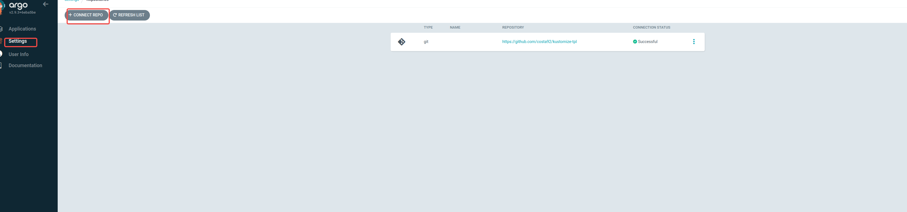
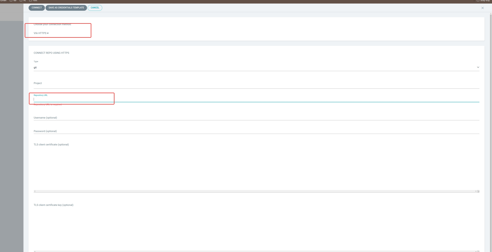
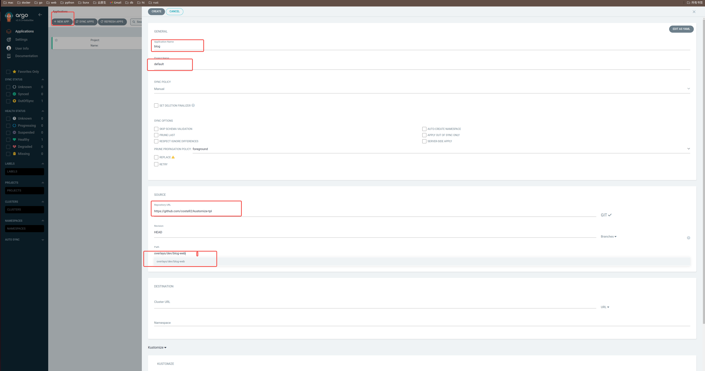
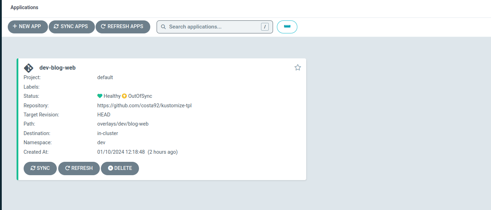

# 安装命令.md

## 根目录执行

```sh
kubectl apply -k public/argocd
```

## 绑定本地端口测试 

```sh
kubectl port-forward svc/argocd-server -n argocd 8080:443
```

## 说明

修改 server.insecure 值，添加一个 argocd-cmd-params-cm-patch.yaml 文件

```yaml
apiVersion: v1
kind: ConfigMap
metadata:
  name: argocd-cmd-params-cm
data:
  server.insecure: "true"
```

修改 kustomization.yaml

```yaml
## changes to config maps
patchesStrategicMerge:
  - argocd-cmd-params-cm-patch.yml
```


## 配置项目

### 配置代码源文件

1. 点击设置

2. 设置git项目

3. 新建项目

4. 成功
